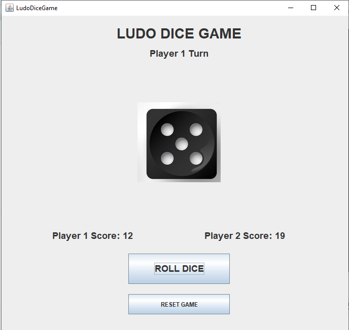
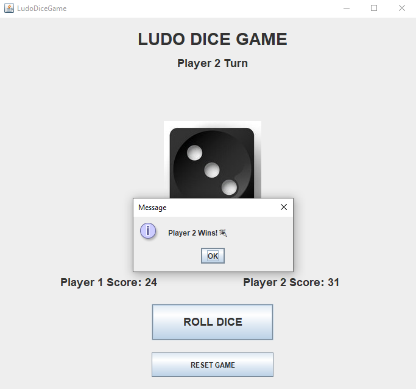

# Java-Ludo-Dice-Game
A Java Swing based Ludo Dice Game with turn system, score tracking, dice rolling, and winner logic.

## Features

* Two Player Turn System
* Dice Rolling Animation
* Random Number Logic
* Score Tracking
* Winner Detection
* Reset Game Functionality
* GUI using Java Swing

## Technologies Used

* Java
* Swing
* AWT
* Random Class

## Files

* LudoDiceGame.java
* README.md
* Dice Images (1.jpg - 6.jpg)

## Screenshot

## Author
Hammad
